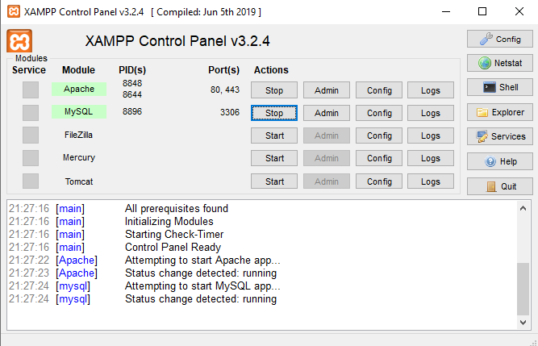
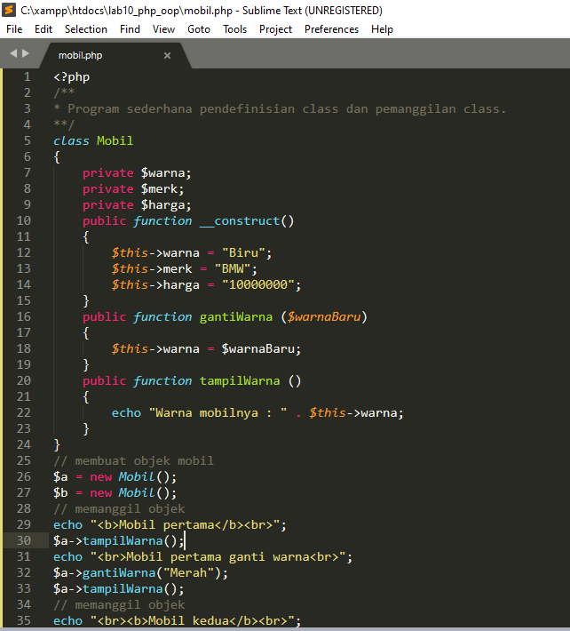
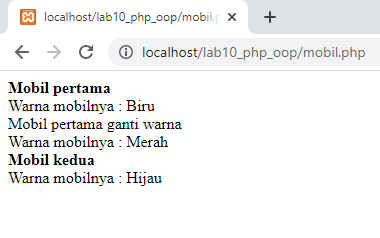
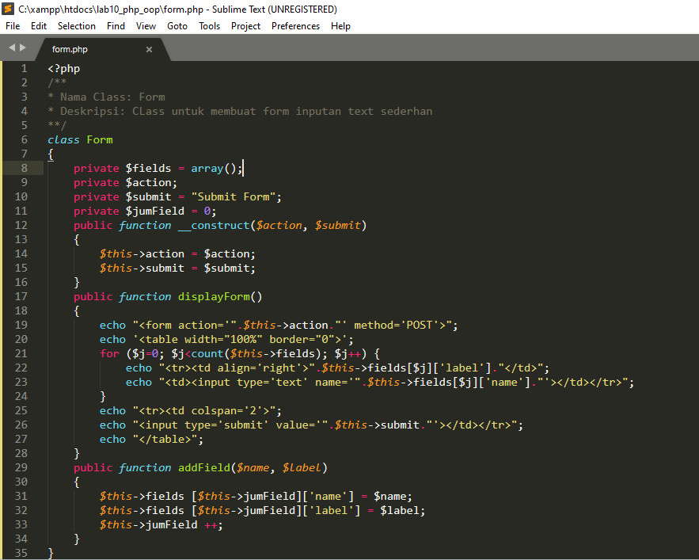
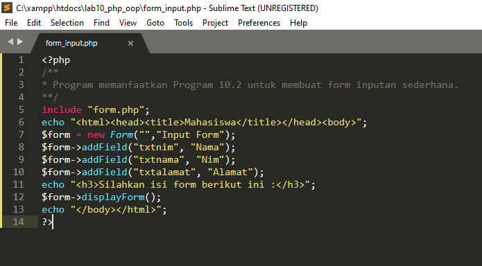
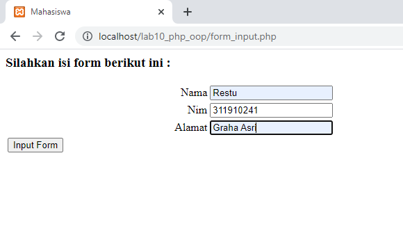

## Langkah - Langkah Pratikum
- Persiapkan text editor seperti sublime text
- Persiapkan juga xampp

### Membuka XAMPP

### Membuat file mobil
buatlah file baru dengan nama mobil.php

output

### Membuat file form

### Membuat file form_input
buatlah file baru dengan nama form_input.php

Outout

